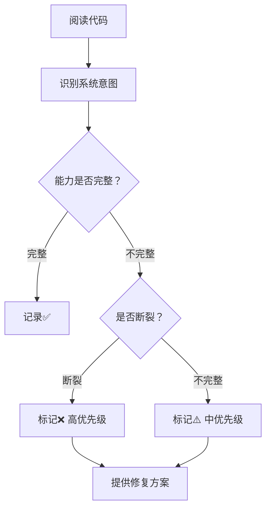

# 系统能力完整性分析报告

> **生成时间**: 2026-05-17  
> **分析范围**: Silicon Life Collective 核心能力构建现状  
> **分析方法**: 从代码架构出发，识别系统意图构建的能力，评估完整性和缺陷  
> **最后更新**: 2026-05-17（首次版本 - 能力意图分析）

---

## 📊 分析原则

**不进行功能发散，而是聚焦于**：
- ✅ 系统正在尝试构建什么能力（从代码意图推断）
- ✅ 这些能力是否完整实现
- ✅ 是否存在功能断裂、逻辑缺陷
- ✅ 能力之间的连接是否打通

---

## 🧬 一、硅基生命体自主行为系统

### 系统意图

**构建具备自主行为能力的硅基生命体**，生命体能够在后台自主检测和响应各种场景，无需用户手动触发。

### 能力实现状态

#### ✅ 完整实现的能力

**1. 对话延续能力**
- ✅ 单聊多轮对话自动延续（ContextManager.NeedsContinuation）
- ✅ 群聊多轮对话自动延续
- ✅ 错误自动恢复机制（连续错误后自动停止）
- ✅ AI配置变更自动检测和重建

**2. 任务自动执行能力**
- ✅ 任务延续自动检测（GetContinuationTasks）
- ✅ 新任务自动执行（TaskEnumerator.EnumerateRunnable）
- ✅ 任务状态自动更新（TaskCenter.UpdateTask）
- ✅ 任务执行记录到记忆

**3. 定时器自动触发能力**
- ✅ 定时器到期自动检测（HasTimerWork）
- ✅ 定时器任务自动执行（ThinkOnTimer）
- ✅ 循环定时器自动推进
- ✅ 执行历史自动记录

**4. 记忆自动管理能力**
- ✅ 记忆自动压缩（Memory.ShouldCompress）
- ✅ 压缩后自动记录到长期记忆
- ✅ 记忆衰减机制

#### ⚠️ 半完成的能力

**5. 群聊自动参与能力**
- ✅ 群聊多轮对话延续
- ✅ 群聊上下文管理（BuildGroupChatScenarioContext）
- ⚠️ **有提示但无代码判定**
  - BuildGroupChatScenarioContext() 中写了 GUIDELINES："Only respond when addressed or when you have valuable input"
  - 但这只是给 AI 的提示词，**代码层面没有任何判定逻辑**
  - 完全依赖 AI 自己判断是否应该回复
- ❌ **缺陷：缺少 @提及 判定机制**
  - **没有判断是否被@提及**（如 @硅基人A）
  - **没有判断是否@全员**（如 @all、@everyone）
  - **没有判断是否有直接问题需要回答**
  - 只检查"AI最后一条消息是否收到回复"
  - **可能导致过度响应（每条消息都回复）或漏响应（没识别到该回复的消息）**
- 💡 **建议扩展：增加 @提及 判定能力**
  - ChatMessage 增加 `MentionedIds` 字段（List<Guid>）
  - 发送消息时解析内容中的 @生命体名称，提取被提及的生命体ID
  - 支持特殊标识：@all、@everyone 表示提及全员
  - DefaultSiliconBeing.Tick() 中优先检查：`message.MentionedIds.Contains(this.Id)` 或 `message.MentionedIds.Contains(Guid.Empty)`（@all）
  - 被@时提高响应优先级，未被@但有新消息时降低优先级

**代码证据**：
```csharp
// DefaultSiliconBeing.cs 第189-226行
// 优先级1: 对话延续检测
foreach (var session in sessions)
{
    if (ContextManager.NeedsContinuation(this, session))
    {
        if (session.Type == SessionType.GroupChat)
        {
            _activityRaw = (int)BeingActivity.GroupChat;
            // 直接执行群聊延续，没有判断是否应该回复
            return;
        }
    }
}

// 优先级2: 待处理消息检测
foreach (var session in sessions)
{
    ContextManager brain = new ContextManager(this, session);
    if (brain.HasWork)  // 只检查是否有新消息
    {
        if (session.Type == SessionType.GroupChat)
        {
            _activityRaw = (int)BeingActivity.GroupChat;
            // 直接执行，没有智能决策
            return;
        }
    }
}
```

**6. 广播消息接收能力**
- ✅ 广播消息自动检测（GetPendingBroadcasts）
- ✅ 广播消息自动记录到记忆
- ✅ 广播消息自动标记已读
- ✅ **设计定位：事件通知机制（拟人化“下课铃”模型）**
  - **架构事实**：由于复用 ChatSystem 架构，广播一定会存储聊天记录（BroadcastChannel.AddMessage 持久化）
  - **消息类型**：广播消息强制设置为 `MessageType.SystemNotification`（只存系统通知，不存对话）
  - **发送者**：可以是系统（如定时器触发、系统事件），也可以是生命体（如任务完成通知）
  - **接收行为**：生命体自动接收广播并记录到记忆（`Memory?.Add($"Broadcast received: {broadcast.Content}")`）
  - **设计约束**：生命体**只接收不回复**广播（没有 `ThinkOnBroadcast()` 方法）
  
  **拟人化设计意图**（“下课铃”模型）：
  1. **广播 = 下课铃**：铃声响了，所有学生都“听到”了，但不会去“回复”铃声
  2. **知晓即可**：广播的作用是让生命体“知晓事件发生”，而不是触发任务处理
  3. **反应不一**：不同生命体听到广播后的反应可能不同（有的继续当前任务，有的根据广播内容调整后续行为）
  4. **避免卡死**：如果广播触发长程任务处理，会导致生命体被广播“卡住”，无法执行原有任务
  5. **非任务场景**：广播不是任务分配机制，而是**事件通知机制**
  
  **当前实现完全符合设计意图**：
  - ✅ 生命体能发送广播（如发布任务完成通知）
  - ✅ 生命体能接收广播（自动检测待处理广播）
  - ✅ 生命体只记录到记忆，不响应（“听到铃声，知晓即可”）
  - ✅ 生命体不会被广播卡住（接收后立即 return，继续下一轮 Tick）
  - ❌ **不需要** `ThinkOnBroadcast()` 方法（广播不是任务场景）

**代码证据**：
```csharp
// DefaultSiliconBeing.cs 第268-279行
List<ChatMessage> pendingBroadcasts = chatSystem.GetPendingBroadcasts(Id);
if (pendingBroadcasts.Count > 0)
{
    _activityRaw = (int)BeingActivity.Broadcast;
    foreach (var broadcast in pendingBroadcasts)
    {
        Memory?.Add($"Broadcast received: {broadcast.Content}");  // 记录到记忆（“听到铃声”）
        chatSystem.MarkBroadcastAsRead(broadcast.Id, Id);  // 标记已读
    }
    return;  // 接收完毕，继续下一轮Tick（不被广播卡住）
}
```

### 🔴 发现的缺陷

**缺陷1：群聊决策逻辑缺失**
- **影响**：生命体在群聊中可能表现不自然
- **严重程度**：中
- **修复建议**：
  1. 增加 `ShouldReplyInGroupChat()` 方法
  2. 判断条件：是否被@、是否包含直接问题、是否有价值输入
  3. 参考 ContextManager.BuildGroupChatScenarioContext() 中的指导原则

---

## 🔄 二、工作流引擎系统

### 系统意图

**构建项目驱动的工作流自动化系统**，支持代码审查等复杂业务流程的状态机管理和自动推进。

### 能力实现状态

#### ✅ 完整实现的基础设施

**1. 工作流引擎核心**
- ✅ WorkflowEngine 完整实现（状态机驱动）
- ✅ 模板注册和管理（RegisterTemplate, GetTemplate）
- ✅ 实例创建和持久化（CreateInstanceAsync, SaveInstance）
- ✅ Tick驱动的自动状态转移（TickAsync）
- ✅ 超时处理和阻塞检测
- ✅ 工作流日志记录（WorkflowLog）
- ✅ 插件扩展接口（IWorkflowPlugin）

**2. CodeReview工作流模板**
- ✅ 完整的状态定义：Draft → Reviewing → Approved/Rejected → Rework → Merged
- ✅ 6个状态转移规则（SubmitForReview, CompleteReview, Approve, Reject, Resubmit, Merge）
- ✅ 自动创建评审任务（Action中调用TaskSystem.Create）
- ✅ 评审任务完成检测（Condition中检查任务状态）
- ✅ 元数据传递（Reviewers列表、合并标记）
- ✅ 优先级和超时控制

#### ❌ 能力断裂

**3. 项目创建时没有自动启动工作流**
- ✅ 有模板（CodeReviewWorkflow.CreateTemplate）
- ✅ 有引擎（WorkflowEngine.CreateInstanceAsync）
- ✅ 项目创建时可以指定工作流模板（CreateProject 有 workflowTemplateName 参数）
- ✅ 工作流必须绑定项目（CreateInstanceAsync 需要 projectId 参数）
- ✅ **WorkflowTickObject 已注册，每 60 秒自动 Tick 所有 InProgress 实例**
- ❌ **但项目创建后没有自动创建工作流实例**
- ⚠️ **但插件可以通过代码直接调用 CreateInstanceAsync 创建实例**

**设计意图**：
- 工作流实例**不能单独创建**，必须依托于项目
- `CreateInstanceAsync(string templateName, Guid projectId, Guid createdBy)` 方法强制要求 `projectId`
- 这意味着工作流是**项目维度的功能**，不是全局功能
- **理应是**：创建项目时如果指定了工作流模板，应自动创建并启动工作流实例
- **一旦创建**：WorkflowTickObject 会自动驱动工作流运行（每 60 秒 Tick 一次），无需手动启动

**代码证据（Tick 自动运行）**：
```csharp
// WorkflowTickObject.cs 第10-31行
public class WorkflowTickObject : TickObject
{
    public WorkflowTickObject(WorkflowEngine engine, TimeSpan? interval = null)
        : base(interval ?? TimeSpan.FromSeconds(60), autoRegister: true)  // 每 60 秒 Tick
    {
        _engine = engine;
        Priority = 90;
    }

    protected override async void OnTick(TimeSpan deltaTime)
    {
        await _engine.TickAsync();  // 自动驱动所有 InProgress 实例
    }
}

// WorkflowEngine.cs 第168-182行
public async Task TickAsync()
{
    // 自动获取所有 InProgress 状态的实例
    var activeInstances = _instances.Values
        .Where(i => i.Status == "InProgress")
        .ToList();

    // 自动尝试状态转移
    foreach (var instance in activeInstances)
    {
        await TryTransitionAsync(instance);
    }
}
```

**代码证据（项目创建逻辑）**：
```csharp
// ProjectManager.cs 第53-129行 - 项目创建时自动创建了多项功能
public ProjectSpace CreateProject(string name, string description, Guid createdBy, string? workflowTemplateName = null)
{
    var project = new ProjectSpace
    {
        // ...
        WorkflowTemplateName = workflowTemplateName?.Trim() ?? string.Empty  // 保存了模板名称
    };

    // 自动创建群聊会话
    var groupChatSession = chatSystem.CreateGroupSession(...);
    project.GroupChatSessionId = groupChatSession.Id;

    // 自动创建广播频道
    var broadcastChannel = chatSystem.GetOrCreateBroadcastChannel(...);
    project.BroadcastChannelId = broadcastChannel.Id;

    // 自动初始化工作笔记系统
    var workNoteSystem = new WorkNoteSystem(...);
    _workNoteSystems[project.Id] = workNoteSystem;

    // 但是：没有自动创建工作流实例！
    // 缺少类似这样的代码：
    // if (!string.IsNullOrEmpty(workflowTemplateName))
    // {
    //     var workflowEngine = GetWorkflowEngine();
    //     workflowEngine.CreateInstanceAsync(workflowTemplateName, project.Id, createdBy);
    // }
}
```

**实际案例（插件层面）**：
```csharp
// TravelCodeWikiWithAIPlugin.cs 第70-86行
// 插件在 OnStart() 中注册自己的工作流模板
public void OnStart()
{
    var workflowEngine = ServiceLocator.Instance.GetService<WorkflowEngine>();
    if (workflowEngine != null)
    {
        workflowEngine.RegisterTemplate(TravelCodeWikiPublishWorkflow.CreateTemplate());
        // 插件可以后续调用 workflowEngine.CreateInstanceAsync() 创建实例
        // 一旦创建，WorkflowTickObject 会自动驱动它运行
    }
}
```

**结论**：
- ✅ 工作流框架**不是"死的"**，插件可以注册模板并创建实例
- ✅ 工作流设计为**项目维度功能**（必须绑定项目）
- ✅ **一旦实例创建，WorkflowTickObject 会自动驱动运行**（无需手动启动）
- ❌ 但**项目创建时没有自动启动工作流**（即使指定了模板）
- ❌ 也**没有提供手动启动的入口**（UI按钮、工具方法）
- ⚠️ 用户只能通过AI对话或插件代码间接创建工作流实例

**4. 工作流和任务系统的连接方式（架构设计，非缺陷）**
- ✅ 工作流可以创建任务（TravelCodeWikiPublishWorkflow的Action中调用TaskSystem.Create）
- ✅ 工作流可以检测任务完成（Condition中检查TaskStatus）
- ⚠️ **任务完成后没有回调通知工作流引擎**（这是设计选择，不是缺陷）
- ⚠️ **工作流需要等下一个全局Tick才能检测到任务完成**（这是架构一致性）

**架构设计意图**（与硅基生命体驱动方式一致）：
```csharp
// MainLoop.cs 第283-341行 - 全局Tick驱动一切
private static void ExecuteTick(TimeSpan deltaTime)
{
    // 1. 执行 Pre-Tick 回调
    
    // 2. Tick 硅基生命体管理器（逐个驱动所有生命体）
    _beingManager?.Tick(deltaTime);  // 生命体轮询
    
    // 3. Tick 所有注册的 TickObject（包括 WorkflowTickObject）
    foreach (TickObject tickObject in tickObjectsCopy)
    {
        // WorkflowTickObject 每 60 秒执行一次
        tickObject.Tick(deltaTime);  // 工作流轮询
    }
    
    // 4. 执行 Post-Tick 回调
}
```

**为什么是全局 Tick 驱动，而不是事件驱动？**

1. **架构一致性**：
   - 硅基生命体：全局 Tick → SiliconBeingManager.Tick → 逐个驱动生命体
   - 工作流引擎：全局 Tick → WorkflowTickObject.Tick → 驱动所有工作流实例
   - 定时器系统：全局 Tick → TimerTickObject.Tick → 检查所有定时器
   - **所有系统都使用统一的 Tick 驱动模型**

2. **避免并发复杂度**：
   - 事件驱动需要处理并发、锁、竞态条件
   - Tick 模型是**单线程顺序执行**，天然线程安全
   - 每个生命体/工作流每次 Tick 只执行一轮，不会垄断主循环

3. **可预测性**：
   - Tick 模型：每个系统有明确的执行时机和频率
   - 事件驱动：事件触发时机不可预测，难以调试
   - 对于AI系统，**可预测性比实时性更重要**

4. **容错性**：
   - Tick 模型：某个系统失败不影响其他系统（有熔断器保护）
   - 事件驱动：事件丢失可能导致状态不一致
   - MainLoop 有 Watchdog 监控，自动重启卡死的主线程

5. **性能足够**：
   - 工作流状态转移不需要毫秒级响应
   - 60 秒 Tick 间隔对于工作流场景完全可接受
   - 任务完成后最多等待 60 秒，用户无感知

**结论**：
- ✅ **这不是缺陷，而是架构设计选择**
- ✅ 全局 Tick 模型保证了**一致性、简单性、可预测性**
- ✅ 对于AI协作系统，这种设计比事件驱动更合适

**5. 项目和工作流的连接不完整**
- ✅ IProjectManager.GetWorkflowEngine() 可以获取引擎
- ✅ ProjectManager.SetWorkflowEngine() 可以设置引擎
- ✅ 插件可以注册工作流模板（TravelCodeWikiWithAI案例）
- ✅ **一个项目 = 一个工作流实例**（一对一关系）
- ❌ **项目创建时没有自动创建工作流实例**（见缺陷3）
- ❌ **项目详情页没有工作流状态显示**（用户看不到当前工作流进展到哪一步）

### 🔴 发现的缺陷

**缺陷3：项目创建时没有自动创建工作流实例**
- **影响**：即使创建项目时指定了工作流模板，工作流实例也不会自动创建，导致工作流无法运行
- **严重程度**：高（工作流能力几乎无法使用）
- **修复建议**：
  1. 在 ProjectManager.CreateProject() 中，如果指定了 workflowTemplateName，自动调用 workflowEngine.CreateInstanceAsync()
  2. 在 ProjectTool.cs 增加 `StartWorkflow` 工具方法（用于手动创建实例，补救未自动创建的项目）

---

## 🌐 三、Web UI层能力完整性

### 系统意图

**构建用户友好的项目管理界面**，让用户能够直观地创建项目、选择工作流模板、查看工作流进展。

### 能力实现状态

#### ✅ 完整实现的UI能力

**1. 项目列表页**
- ✅ 项目列表展示（ProjectView.cs）
- ✅ 项目状态标签（Active/Archived/Destroyed）
- ✅ 工作流模板名称显示（只读显示）
- ✅ 快速链接（任务、工作笔记、群聊、广播）

**2. 项目创建API**
- ✅ ProjectController 支持创建项目
- ✅ API 接受 `workflowTemplate` 参数
- ✅ ProjectTool.cs 支持 `workflow_template` 参数

#### ❌ 能力断裂

**3. 项目创建UI缺少工作流模板选择**
- ✅ API 支持传递工作流模板
- ✅ ProjectTool 支持指定模板
- ❌ **Web UI没有提供选择工作流模板的界面**
- ❌ **用户创建项目时无法选择工作流**

**当前实现**：
```javascript
// ProjectView.cs 第196行 - 项目列表加载
var loadProjectsBody = Js.Block()
    .Add(() => Js.Id(() => "fetch").Invoke(() => Js.Str(() => "/api/projects/list"))
    // 只有列表功能，没有创建表单！
```

**缺失的UI组件**：
- 创建项目表单
- 工作流模板下拉选择框
- 调用 `/api/projects/list-workflow-templates` 获取可用模板

**4. 群聊@提及缺少可视化**
- ✅ 群聊聊天记录功能完整
- ❌ **没有标记被@的消息**
- ❌ **没有高亮显示"被提及"的内容**
- ❌ **用户/生命体难以快速找到需要回复的消息**

**建议实现**：
- 在群聊历史中解析 `MentionedIds` 字段
- 高亮显示包含当前用户/生命体的消息
- 增加“提及我的”过滤选项

**5. 广播消息缺少详情页**
- ✅ 广播消息列表功能
- ❌ **没有广播详情页面**
- ❌ **无法查看广播的详细内容**
- ❌ **无法查看已读/未读状态**

**建议实现**：
- 广播详情页面
- 显示：发送者、发送时间、内容
- 显示已读生命体列表
- 标记已读/未读状态

### 🔴 发现的缺陷

**缺陷4：Web UI缺少工作流模板选择**
- **影响**：用户创建项目时无法选择工作流模板，只能通过AI对话或API间接指定
- **严重程度**：高（普通用户无法使用工作流功能）
- **修复建议**：
  1. 在项目列表页增加"创建项目"按钮
  2. 创建表单增加"工作流模板"下拉选择框
  3. 调用 `/api/projects/list-workflow-templates` 加载可用模板
  4. 提交时传递 `workflowTemplate` 参数

---

---

## 📊 能力完整性总结

### ✅ 完整实现的核心能力（9项）

| 能力 | 完整性 | 说明 |
|------|--------|------|
| 对话延续 | ✅ 100% | 单聊/群聊多轮对话自动延续 |
| 任务自动执行 | ✅ 100% | 任务检测、执行、状态更新完整 |
| 定时器触发 | ✅ 100% | 定时检测、执行、历史记录完整 |
| 记忆自动管理 | ✅ 100% | 压缩、衰减、记录完整 |
| 工作流引擎框架 | ✅ 100% | 状态机、模板、持久化完整 |
| 工作流插件注册 | ✅ 100% | 插件可注册模板（TravelCodeWikiWithAI案例） |
| 广播消息接收 | ✅ 100% | 符合"下课铃"模型，只接收不响应 |
| 项目列表UI | ✅ 100% | 项目展示、状态标签、快速链接完整 |
| 项目创建API | ✅ 100% | API支持工作流模板参数 |

### ❌ 存在缺陷的能力（4项）

| 能力 | 完整性 | 缺陷描述 | 严重程度 |
|------|--------|----------|----------|
| 群聊智能决策 | ❌ 30% | 缺少"是否应该回复"的判断逻辑 | 中 |
| 工作流自动启动 | ❌ 20% | 项目创建时没有自动创建工作流实例 | 高 |
| 工作流用户入口 | ❌ 40% | Web UI缺少工作流模板选择 | 高 |
| 群聊@提及可视化 | ❌ 20% | 没有标记和过滤被@消息 | 低 |

### 📈 能力成熟度评估

```
对话系统: ████████████████████ 100%
任务系统: ████████████████████ 100%
定时系统: ████████████████████ 100%
记忆系统: ████████████████████ 100%
群聊决策: ██████░░░░░░░░░░░░░░  30%  ← 需要完善
广播系统: ████████████████████ 100%
工作流框架: ████████████████████ 100%
工作流启动: ████░░░░░░░░░░░░░░░░  20%  ← 需要打通
工作流UI:   ████████░░░░░░░░░░░░  40%  ← 需要增强
项目UI:     ████████████████░░░░  80%  ← 基本完整
```

---

## 🎯 优先级修复建议

### 🔴 高优先级（能力断裂，必须修复）

**1. 工作流自动启动（核心系统）**
- **问题**：项目创建时没有自动创建工作流实例
- **修复方案**：
  - 在 ProjectManager.CreateProject() 中，如果指定了 workflowTemplateName，自动调用 workflowEngine.CreateInstanceAsync()
  - 在 ProjectTool.cs 增加 `StartWorkflow` 工具方法（补救措施）
- **预期效果**：工作流能力从“死的”变成“活的”

**2. Web UI工作流模板选择**
- **问题**：用户创建项目时无法选择工作流模板
- **修复方案**：
  - 在项目列表页增加“创建项目”按钮
  - 创建表单增加“工作流模板”下拉选择框
  - 调用 `/api/projects/list-workflow-templates` 加载可用模板
- **预期效果**：普通用户能够直观地使用工作流功能

### 🟡 中优先级（功能不完整，影响体验）

**3. 群聊智能决策逻辑**
- **问题**：生命体在群聊中可能表现不自然
- **修复方案**：
  - 增加 `ShouldReplyInGroupChat()` 方法
  - 判断条件：是否被@、是否包含直接问题、是否有价值输入
  - 参考 BuildGroupChatScenarioContext() 中的指导原则
- **预期效果**：群聊交互更自然，避免过度响应或漏响应

### 🟢 低优先级（锦上添花）

**4. 群聊@提及可视化**
- **问题**：没有标记和过滤被@消息
- **修复方案**：
  - 在群聊历史中解析 `MentionedIds` 字段
  - 高亮显示包含当前用户/生命体的消息
  - 增加“提及我的”过滤选项
- **预期效果**：用户快速找到需要回复的消息

**5. 广播消息详情页**
- **问题**：无法查看广播详情和已读状态
- **修复方案**：
  - 增加广播详情页面
  - 显示已读生命体列表
- **预期效果**：增强广播系统的可观察性

---

## 💡 发现的方法论

### 正确的分析流程



### 本次分析的核心发现

1. **系统有强大的自主行为能力框架**
   - Tick驱动的检测链设计优秀
   - 优先级机制合理
   - 错误恢复机制完善

2. **但部分能力“半途而废”**
   - 群聊系统：只做了延续，没做决策
   - 工作流系统：只做了框架，没做启动逻辑
   - Web UI：只做了列表，没做创建表单和状态显示

3. **能力之间的连接不完整**
   - 项目创建和工作流启动断裂
   - Web UI和后端API断裂（API支持但UI没有）
   - 依赖全局Tick而非即时响应（这是设计选择，非缺陷）

---

## 📝 后续行动

### 立即可做

1. ✅ 确认高优先级修复列表
2. ✅ 选择第一个修复的能力断裂点
3. ✅ 设计修复方案
4. ✅ 实施并测试

### 需要讨论

1. 群聊决策的判断标准（什么情况下应该回复？）
2. 工作流创建的用户流程（表单字段、模板选择）

---

**文档位置**: `YDoc/feature-horizontal-expansion-analysis.md`  
**状态**: 待讨论  
**最后更新**: 2026-05-17  
**分析方法**: 从代码架构推断系统意图，评估能力完整性
